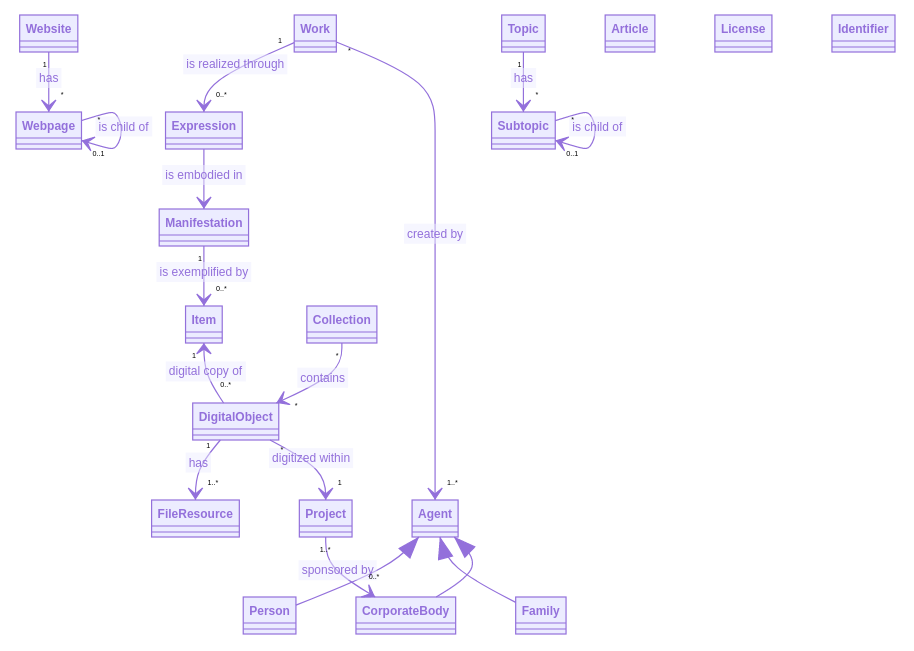
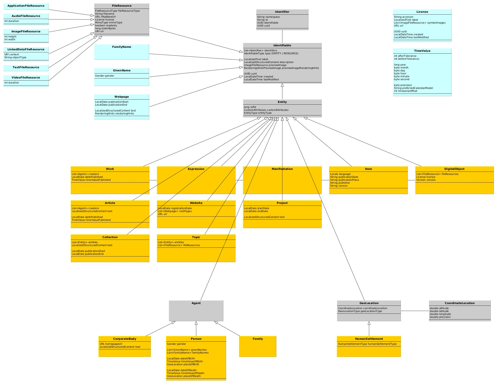

# Digitalcollections Model

[](https://javadoc.io/doc/de.digitalcollections.model/dc-model-parent)
[](https://travis-ci.org/dbmdz/digitalcollections-model)
[](https://codecov.io/gh/dbmdz/digitalcollections-model)
[](LICENSE)
[](https://github.com/dbmdz/digitalcollections-model/releases)
[](https://search.maven.org/search?q=a:dc-model-parent)

Java library containing Domain Object classes of the Digital Collection's and Digital Humanities ecosystem.
Primarily started from the needs for [GLAM](https://en.wikipedia.org/wiki/GLAM_%28industry_sector%29)s (Galleries, Libraries, Archives, Museums) but not restricted to it.

## Business Domain Model

The domain model follows the FRBR ([Functional Requirements for Bibliographic Records](https://en.wikipedia.org/wiki/Functional_Requirements_for_Bibliographic_Records)).
The model is not restricted to books but can handle all sort of creative works and their digital counterparts ("digital objects").

One core statement (taken from [Music Cataloging at Yale](https://web.library.yale.edu/cataloging/music/frbr-wemi-music)) is:

```
"A work is realized by an expression, which is embodied in a manifestation, which is exemplified by an item."
```

And the central object of interest of digital collections is the `DigitalObject` as the digital representation of an item
and curated `Collections` as group of digital objects.



* For presenting digital collections online the library offers `Website` and `Webpage` classes.
* For arranging and describing digital objects by topics the library offers `Topic` and `Subtopic` classes.
* For editorial contribution in the context of digital collections the library offers `Article` with rich text formatting and embedding of different media.

The following classes can be assigned to objects (where appropriate):

* a freely definable `License`
* a list of freely definable `Identifier`s, each of them identifying the object uniquely in an external source system, e.g. GND-ID ("gnd:104330171") or VIAF-ID ("viaf:96994450").

## Class Diagram

The classes are modelled after the business domain model. Common properties and characteristics are expressed through some inheritance (Entity, Identifiable).



## Technical Model Classes

This library supports practical handling of above domain model by adding paging, filtering and sorting classes.

### Filtering-Model

Model for passing technology independent filter criterias
* from frontend to backend via URL-params,
* from Java code to backend

Backend has to take care about implementing technology dependent filtering for given criterias.

#### Filtering by using (user given) URL params

Example usage in a Spring MVC controller: return only webpages with active publication time range

Example URL: http://localhost/v5/webpages?publicationStart=gte:2021-01-01&publicationEnd=lt:2021-10-01

```java
@Operation(summary = "Get all webpages")
@GetMapping(value = {"/v5/webpages", "/v2/webpages"}, produces = MediaType.APPLICATION_JSON_VALUE)
public PageResponse<Webpage> findAll(
    @RequestParam(name = "pageNumber", required = false, defaultValue = "0") int pageNumber,
    @RequestParam(name = "pageSize", required = false, defaultValue = "25") int pageSize,
    @RequestParam(name = "sortBy", required = false) List<Order> sortBy,
    @RequestParam(name = "publicationStart", required = false) FilterCriterion<LocalDate> publicationStart,
    @RequestParam(name = "publicationEnd", required = false) FilterCriterion<LocalDate> publicationEnd) {
  PageRequest pageRequest = new PageRequest(pageNumber, pageSize);
  ...
  Filtering filtering =
      Filtering.defaultBuilder()
          .add("publicationStart", publicationStart)
          .add("publicationEnd", publicationEnd)
          .build();
  pageRequest.setFiltering(filtering);
  return webpageService.find(pageRequest);
}
```

REST-API design for filtering was inspired by:

- [REST API Design: Filtering, Sorting, and Pagination](https://www.moesif.com/blog/technical/api-design/REST-API-Design-Filtering-Sorting-and-Pagination/)
- [An example application using Spring boot MVC, Spring Data JPA with the ability to do filter, pagination and sorting.](https://github.com/vijjayy81/spring-boot-jpa-rest-demo-filter-paging-sorting)

##### Supported URL-params based filter operations

<table border="1">
  <caption>Mapping operation abbreviation to filter operation</caption>
  <tr><th>Symbol</th><th>Operation</th><th>Example filter URL query param</th></tr>
  <tr><td>eq       </td><td> Equals                     </td><td>city=eq:Munich	         </td></tr>
  <tr><td>neq      </td><td> Not Equals                 </td><td>country=neq:de          </td></tr>
  <tr><td>gt       </td><td> Greater Than               </td><td>amount=gt:10000         </td></tr>
  <tr><td>gte      </td><td> Greater Than or equals to  </td><td>amount=gte:10000        </td></tr>
  <tr><td>lt       </td><td> Less Than                  </td><td>amount=lt:10000         </td></tr>
  <tr><td>lte      </td><td> Less Than or equals to     </td><td>amount=lte:10000        </td></tr>
  <tr><td>in       </td><td> IN                         </td><td>country=in:uk, usa, au  </td></tr>
  <tr><td>nin      </td><td> Not IN                     </td><td>country=nin:fr, de, nz  </td></tr>
  <tr><td>btn      </td><td> Between (inclusive)        </td><td>joiningDate=btn:2018-01-01, 2016-01-01</td></tr>
  <tr><td>like     </td><td> Like                       </td><td>firstName=like:John     </td></tr>
  <tr><td>set      </td><td> value exists (not null)    </td><td>firstName=set:          </td></tr>
  <tr><td>notset   </td><td> value is not set (null)    </td><td>firstName=notset:       </td></tr>
</table>

## Model-Serializing

Comes with a separate module for supporting serializing model objects to JSON (`dc-model-jackson module`) using [Jackson](https://github.com/FasterXML/jackson)


## Systems implementing this library

* [cudami (cultural digital asset management)](https://github.com/dbmdz/cudami)